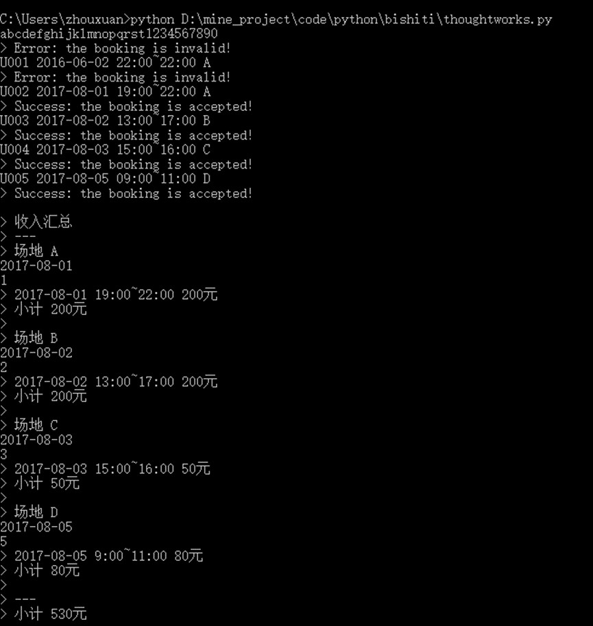
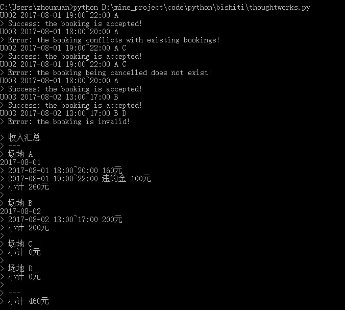

## 题目描述
小明是一个羽毛球场馆的管理员，管理着四个羽毛球场地（A，B，C，D场地），负责场地的维护和预订工作。为了简化自己的工作，场地只接受整点预订，预订以小时为单位。
羽毛球场的收费标准如下：
- 周一到周五 
  - 9:00 ~ 12:00 30元/时
  - 12:00 ~ 18:00 50元/时
  - 18:00 ~ 20:00 80元/时
  - 20:00 ~ 22:00 60元/时
- 周六及周日
  - 9:00 ~ 12:00 40元/时
  - 12:00 ~ 18:00 50元/时
  - 18:00 ~ 22:00 60元/时
羽毛球场馆在预订之后，可以接受取消预订，不不过取消预订需要交违约金，违约金的计算规则如下：
    - 周一到周五的预订取消收取全部费用的50%作为违约金
    - 周六周日的预订取消收取全部费用的25%作为违约金
由于手头还有其他工作，小明希望能够借助计算机程序来自动化处理预订及取消预订的事务，并且希望程序能够打印出场馆的收入汇总情况。
## 项目使用说明
### 相关依赖
本程序使用Python2.7完成，可以在linux和windows系统上运行。
### 运行说明
运行时切换到程序所在目录，运行：
```
python badminton.py
```
在控制台中输入预定/取消命令。命令格式为
- 格式为 {用户ID} {预订日期 yyyy-MM-dd} {预订时间段 HH:mm~HH:mm} {场地} {是否取消}
- 如果取消在{是否取消}位置输入C
程序会对输入的命令进行格式校验，若符合格式则对该时间段的场地进行预定或取消。否则提示输入格式错误。
程序示例如下


